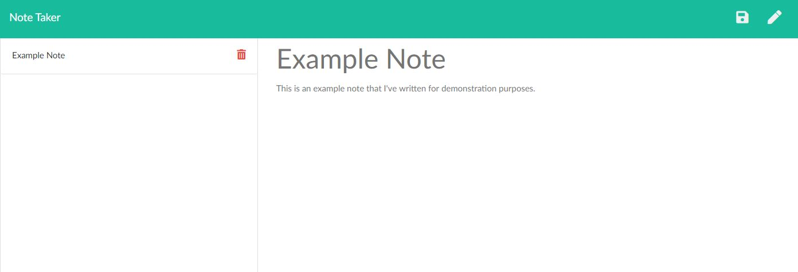
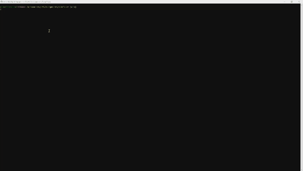

# Note Taker

[](https://www.gnu.org/licenses/gpl-3.0)
## Description 
  This application is designed using expressjs and nodejs to allow a user to write, save and delete notes online from a JSON file. We needed to create the server, setup the routes and the API functionality. The front-end was designed already.

```
AS A user, I want to be able to write and save notes
I WANT to be able to delete notes I've written before
SO THAT I can organize my thoughts and keep track of tasks I need to complete
```

   <br>

   <br>    

  ## Hosted Version
  https://andrews-notetaker.herokuapp.com/notes

  ---
  ## Table of Contents

  * [Installation](#installation)
  * [Usage](#usage)
  * [License](#license)
  * [Questions](#questions)

  ---
  ## Installation 
  1. `git clone https://github.com/diemrbond/NoteTaker` 
  2. `npm install`
  
  ---
  ## Usage 
  1. `npm run dev` OR
  2. `npm start`
  
  ---
  ## License 
  This application is licensed under: GNU GPLv3
  
This program is free software: you can redistribute it and/or modify it under the terms of the GNU General Public License as published by the Free Software Foundation, either version 3 of the License, or (at your option) any later version.

This program is distributed in the hope that it will be useful, but WITHOUT ANY WARRANTY; without even the implied warranty of MERCHANTABILITY or FITNESS FOR A PARTICULAR PURPOSE. See the GNU General Public License for more details.

You should have received a copy of the GNU General Public License along with this program. If not, see <https://www.gnu.org/licenses/>.

  
  ---
  ## Questions
  If you have any questions about this project, please feel free to contact me via the following information:

  

  Andrew Kelleher

  Github: https://github.com/diemrbond

  Email: [mrbondmustdie@gmail.com](mailto:mrbondmustdie@gmail.com)

  ---
  © 2020 Andrew Kelleher | diemrbond.github.io 
